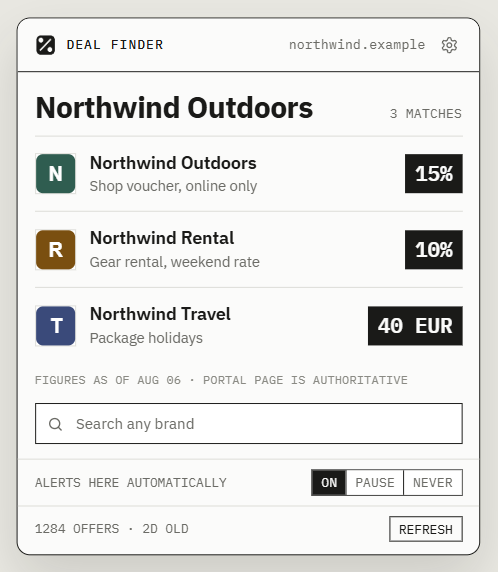

# CB Deal Finder

[](https://github.com/lucasfirl/benefits-chrome/actions/workflows/ci.yml)

A Chrome extension that tells you when the site you're browsing has an offer
waiting in your Corporate Benefits employee portal (`*.mitarbeiterangebote.de`
and similar CB-powered portals). It uses the login session you already hold in
your browser, and decides every match locally. UI in English or German,
auto-selected from your browser's language.

**→ [Add to Chrome](https://chromewebstore.google.com/detail/cb-deal-finder/kmijkgcnhgjbkjlfcijccgnfhailkdoj) ·
[Privacy policy](PRIVACY.md) ·
[Releases](https://github.com/lucasfirl/benefits-chrome/releases/latest)**

> Private, unofficial tool. Not affiliated with, operated by, endorsed by or
> reviewed by corporate benefits Germany GmbH. See [Disclaimer](#disclaimer).

<p align="center">
  
  <br>
  <sub>Sample data — real portal offers are confidential and must not be reproduced.</sub>
</p>

---

## What it does

- You give it your employer's portal address once — every employer has its own
  slug, e.g. `yourcompany.mitarbeiterangebote.de`. The address is probed before
  it is saved, so a typo can't silently replace a working one.
- It reuses your existing logged-in session on that portal. It never asks for
  or stores a password, and does not hold the `cookies` permission.
- **The catalogue is downloaded once a week** and matching happens locally,
  offline — [this is the point of the design](#why-a-weekly-catalogue).
- Brand matching uses the site's domain (e.g. `philips.de` → `philips`) and,
  optionally, the page's `<title>` and `og:site_name`.
- Matches show as a count on the toolbar badge; click the icon for the list and
  jump straight to the offer on your portal.
- You can search any brand by hand from the popup, whatever site you're on.

## Why a weekly catalogue

The obvious design — query the portal's search on every page you visit — does
not scale. Measured on the real code, that was ~2.4 requests per page view
(misses cost the most, because the candidate loop only stops on a *hit*), and
tab switches triggered full rescans with no caching at all. For a single user
that's invisible; across a whole company it would be hundreds of thousands of
requests a day and would read, in the portal's logs, as distributed scraping.

So instead the extension fetches the catalogue **once a week**:

1. Loads the portal home page and reads the top-level category ids from the
   navigation (discovered, not hardcoded — every employer's portal differs).
2. Fetches each `/overview/<id>` page, spaced 1.5 s apart rather than as a
   burst. Each one returns its full offer list in a single response — the
   portal does not paginate these.
3. Stores brand names + offer links in `chrome.storage.local`.

After that, matching a site is a **local string comparison — zero requests**.

| | requests/user/day | at 1,000 users |
|---|---|---|
| per-page search (before) | ~600 | 600,000 |
| weekly catalogue (now) | **~2** | **2,000** |

The important property is that the cost no longer scales with browsing: a heavy
surfer costs the same as someone who barely opens the browser. Failed syncs are
put behind a back-off rather than retried on the next page view, so an expired
login can't turn into a steady drip of rejected requests either.

Matching normalises both sides (lowercase, umlauts, punctuation removed), so
`easyairportparking.de` matches "Easy Airport Parking" without needing the page
title at all. It is deliberately conservative — a short brand like "On" matches
only exactly, never by prefix, so `onlineshop.de` won't claim a discount that
doesn't exist. If the catalogue is missing or older than a week, the extension
falls back to live search so it never appears broken.

## Settings

Everything beyond the plain badge is opt-in.

**Automatic finding** (off by default) registers a tiny content script on every
page. It reads only `document.title` and the `og:site_name` meta tag — nothing
else — so the badge is accurate immediately, without opening the popup. This
needs the broad "read every site" permission, which is exactly why it is off
until you ask for it. Without it, the badge updates on tab switch/reload using
the domain guess alone, and the popup does the more accurate check on click.

**How loudly a match is announced** (only applies while automatic finding is
on):

- *Badge only* — no interruption, just the toolbar count.
- *Desktop notification* — a dismissible OS notification, once per page.
- *Try to open the popup automatically* (default) — attempts
  `chrome.action.openPopup()`; Chrome frequently blocks this outside a direct
  click, so it silently falls back to a desktop notification.

Tabs restored at browser startup never announce themselves — you didn't just
open those pages — but they still count towards the badge.

**Sites you switched off.** From the popup you can silence a site until the
browser closes, or for good, and choose whether that covers just the host or
the whole domain. The settings page lists them and accepts patterns:
`*.google.com` covers google.com and all its subdomains, `google.*` covers
google.de and google.com. The badge keeps counting on muted sites; only the
automatic alert stops.

**What counts as a brand name.** The domain always counts. Page titles find
more (they're what catches `easyairportparking.de`), but on sites that aren't
shops a title fragment can produce a stray match — so a title only ever counts
when it matches a brand name *exactly*, and you can switch titles off entirely
for the strictest behaviour.

**Offer catalogue.** Shows the offer count and age, with a manual refresh for
when a percentage looks wrong.

## Install

1. [Add CB Deal Finder to Chrome](https://chromewebstore.google.com/detail/cb-deal-finder/kmijkgcnhgjbkjlfcijccgnfhailkdoj)
   and pin it to the toolbar so the badge is visible.
2. Click the extension icon → the gear (or right-click the icon → Options) and
   enter your portal address, e.g. `yourcompany.mitarbeiterangebote.de`.
3. Approve the permission prompt — this grants access to that one portal domain
   only.
4. Make sure you're logged in to your CB portal in a regular tab.
5. (Optional) Enable automatic finding and pick a notification style.
6. Browse to any brand's site — the badge (or popup) shows matching deals.

### From source

Clone the repo, then in `chrome://extensions` enable **Developer mode** and
use **Load unpacked** on the **`src/`** folder — that's where `manifest.json`
lives; pointing Chrome at the repo root won't work. Unpacked
[release ZIPs](https://github.com/lucasfirl/benefits-chrome/releases/latest)
are already rooted at the manifest, so those you load directly.

After pulling changes, click the reload icon on the extension's card —
background script and manifest changes don't apply until you do.

## Development

```sh
node test/run-all.js     # all tests, no dependencies beyond Node 22
```

Everything that ships lives in `src/`; everything else in the repo does not.
That boundary is the whole packaging rule: the ZIP is the **contents** of
`src/`, zipped from inside it so `manifest.json` lands at the archive root,
where Chrome expects it. Nothing needs excluding, because nothing that must not
ship lives there in the first place.

```sh
cd src && zip -qr ../dist/cb-deal-finder-1.1.0.zip .
```

CI runs the tests on every push and PR and uploads that ZIP as an artifact.
Pushing a `v*` tag runs [`release.yml`](.github/workflows/release.yml), which
tests, builds the same archive and publishes it as a GitHub release.

### Layout

| Path | What it is |
|---|---|
| `src/manifest.json` | MV3 manifest. |
| `src/background.js` | Service worker: watches tabs, syncs and matches the catalogue, manages badge/notifications, answers popup and content-script requests. |
| `src/common.js` | Shared helpers — URL normalisation, brand guessing, matching, i18n. |
| `src/content-hints.js` | Opt-in content script (registered dynamically when automatic finding is on) reporting page title / `og:site_name`. |
| `src/offscreen.js` / `.html` | Offscreen document that parses the portal's HTML with a real `DOMParser` — service workers have no DOM. |
| `src/popup.*` | Toolbar popup UI. |
| `src/options.*` | Settings page: status, portal address, automatic finding, notification style, brand sources, mute list, catalogue. |
| `src/theme.css`, `src/fonts/` | Shared design tokens; IBM Plex bundled locally so the UI makes no outbound request. |
| `src/_locales/en`, `/de` | UI text; Chrome picks by browser language, falling back to English. |
| `assets/` | Images used by this README. Not shipped. |
| `test/` | See below. |

### Tests

Run everything with **`node test/run-all.js`**. The behavioural tests load the
real `src/background.js` in a `vm` sandbox with stubbed Chrome APIs, so they assert
against shipping code rather than a reimplementation.

| Test | Asserts |
|---|---|
| `catalog.test.js` | A fresh catalogue makes **zero** portal requests; a stale one falls back to live search. |
| `matching.test.js` | The local name matcher, including the false positives it must reject. |
| `match-sources.test.js` | The "what counts as a brand name" setting, with and without page titles. |
| `scan-order.test.js` | Replays browser event orderings: the hint-based result must win over a late hintless one. |
| `backoff.test.js` | After a failed sync, page views must not each kick off a new one. |
| `redirect.test.js` | An expired portal session is recognised even when the portal redirects silently instead of to `/login`. |
| `mute.test.js` | "Pause" stays in session storage, "Never" lands in sync storage, and both leave the badge alone. |
| `startup-notify.test.js` | Tabs restored at browser startup raise no notification, but still count. |

## Limitations

- Without automatic finding, the badge is domain-heuristic only and can
  under-count until you open the popup.
- Automatic finding needs the broad all-sites permission, because Chrome only
  lets extensions read page content without a user gesture if they hold it.
- The "auto-open popup" level is best-effort; `chrome.action.openPopup()` is
  restricted outside direct user gestures and often falls back to a
  notification.
- Single-page-app navigations that trigger neither a full page load nor a
  `chrome.tabs.onUpdated` "complete" event won't auto-rescan until you switch
  tabs or reload; use the popup's manual search.
- Discount amounts and monthly specials are not stable. With a one-week cache
  lifetime a percentage can be out of date, so the popup shows the data's age
  and offers a refresh; the authoritative figure is on the portal page anyway.
- Location-dependent offers ("Regionales") are in the catalogue by brand, but
  the local matcher can't filter them by your location. Use the search box.
- Only one portal origin at a time; saving a new address replaces the old one.
- If your portal changes its HTML structure, the parser in `src/offscreen.js`
  (`.cbg3-list-item` selectors) may need updating. It already handles the two
  different nestings the portal uses for the same item (`h3 > a` on search
  results, `a > h3` on category pages) — matching on `h3 a` silently returns
  nothing on category pages.

## Disclaimer

This is a private, unofficial tool. It is **not affiliated with, operated by,
endorsed by, or reviewed by corporate benefits Germany GmbH**. All brand names,
product names and logos referenced or displayed belong to their respective
owners.

The offer catalogue is deliberately downloaded only once a week — staggered
rather than in one burst — and all matching afterwards happens locally in your
browser. This is done explicitly to keep load on corporate benefits' servers as
low as possible: instead of a search request on every page you visit, only a
handful of requests are made per week.

Discount figures shown come from the locally cached catalogue and may be out of
date — only the offer page on the portal itself is authoritative. Provided
as-is, without warranty of any kind and without liability.

The offers and discount codes retrieved are subject to your portal's terms of
use and are confidential: they are intended for eligible employees only and
must not be shared with third parties or published. This tool does not change
that — it only shows you, locally, what your own account can already see.
